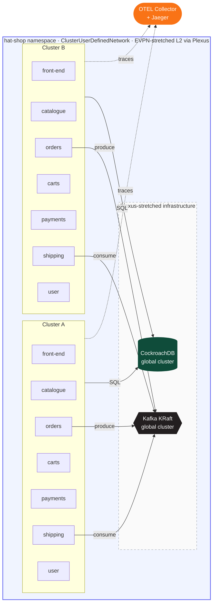

# 🎩 Hat Shop

**A multi-cluster microservices demo powered by [Plexus](https://github.com/ovn-kubernetes) — OVN-Kubernetes's AdministrativeNetworkDomain (AND).**

Hat Shop is a simple e-commerce application for buying hats. It exists to demonstrate one thing: **state replication across Kubernetes clusters, enabled entirely by Plexus, with zero application-level sync code.**

Place an order on **Cluster A**. Switch to **Cluster B**. Your order is already there.

---

## Architecture



### Services

| Service     | Language   | Role                                              |
|-------------|------------|---------------------------------------------------|
| `front-end` | TypeScript | Next.js UI — shows cluster badge, catalogue, orders |
| `catalogue` | Go         | Hat listings — reads from CockroachDB             |
| `orders`    | Go         | Order creation — writes to CockroachDB, publishes to Kafka |
| `carts`     | Go         | Per-user cart — reads/writes CockroachDB          |
| `payments`  | Go         | Payment authorisation — writes to CockroachDB     |
| `shipping`  | Go         | Kafka consumer — creates shipment records in CockroachDB |
| `user`      | Go         | Registration, login (JWT)                         |

### Infrastructure

| Component      | Topology                                      |
|----------------|-----------------------------------------------|
| CockroachDB    | Single cluster, nodes split across clusters via Plexus EVPN |
| Kafka (KRaft)  | Single cluster, brokers split across clusters via Plexus EVPN |
| Observability  | OTEL SDK in every service → external collector + Jaeger |

### Cross-cluster DNS (Plexus)

Pods in the same AND namespace are resolvable across clusters as:

```
<hostname>.<subdomain>.<cudn-name>.svc.clusterset.local
```

CockroachDB and Kafka use cluster-specific subdomains (`crdb-a`, `crdb-b`, `kafka-a`, `kafka-b`) so the join lists scale to N clusters.

---

## Quickstart — local dev

Requires: `podman`, `kubectl` (for kustomize), `docker compose`

```bash
# Start the observability stack (Jaeger at http://localhost:16686)
make observability

# Deploy the full app locally via podman kube play
make dev

# Tear down
make dev-down
```

## Deploy to two clusters

```bash
# On cluster-a context
make deploy-a

# Initialise CockroachDB (once, on cluster-a only)
make crdb-init

# On cluster-b context
make deploy-b
```

Set `OTEL_COLLECTOR_HOST` in each overlay's `cluster-config-patch.yaml` to the IP of the host running `make observability`.

---

## The demo

1. Visit `http://<cluster-a-node>:30000` — note the **cluster-a** badge
2. Register an account, browse the catalogue, add hats to your cart, place an order
3. Visit `http://<cluster-b-node>:30000` — note the **cluster-b** badge  
4. Log in with the same credentials — your order history is already there
5. Open Jaeger at `http://localhost:16686` — find the `orders` trace and see spans from both clusters

---

## Repository layout

```
hat-shop/
├── go.work                        Go workspace (all backend services)
├── Makefile
├── services/
│   ├── catalogue/                 Go service + Dockerfile
│   ├── orders/
│   ├── carts/
│   ├── payments/
│   ├── shipping/
│   ├── user/
│   └── front-end/                 Next.js + TypeScript + Dockerfile
├── pkg/
│   ├── db/                        Shared CockroachDB pool
│   ├── middleware/                HTTP middleware (auth, logging, OTEL)
│   └── tracing/                   OTEL initialisation
├── deploy/
│   ├── kubernetes/
│   │   ├── base/                  Kustomize base manifests
│   │   └── overlays/
│   │       ├── cluster-a/         cluster-a patches (CRDB/Kafka join lists)
│   │       ├── cluster-b/
│   │       └── local/             podman kube play (single-node CRDB + Kafka)
│   └── observability/             docker-compose: OTEL collector + Jaeger
└── docs/
    └── architecture.md
```

---

## About Plexus

Plexus is OVN-Kubernetes's multi-cluster networking layer. The **AdministrativeNetworkDomain (AND)** concept provides:

- **(a)** Namespace same-ness across clusters
- **(b)** Per-namespace `ClusterUserDefinedNetwork` (OVN-K8s)
- **(c)** EVPN-stretched L2 network between clusters
- **(d)** Multi-cluster DNS (`*.svc.clusterset.local`)

Hat Shop requires no multi-cluster-aware application code. CockroachDB and Kafka form single global clusters because Plexus makes the network look flat.
